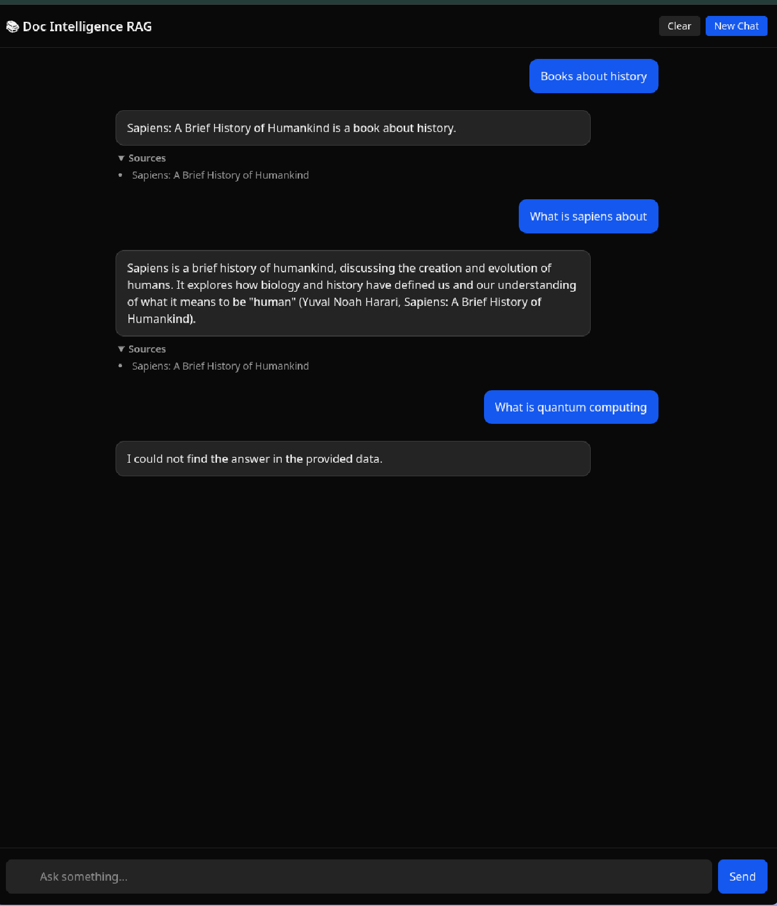

# Doc Intelligence RAG Platform

A full-stack Retrieval-Augmented Generation (RAG) system that ingests external data, builds a semantic vector index, and answers user queries using context-aware responses from a local language model.

The system is designed to reduce hallucination by ensuring that every generated answer is grounded in retrieved data.

Example responses using mistralai/mistral-7b-instruct-v0.3 and only 3 books in database:

---

## Overview

Large language models often generate plausible but incorrect answers when they lack relevant context. This project addresses that limitation by combining semantic retrieval with controlled generation.

At a high level, the system computes:

Answer = f(query, retrieved_context)

Instead of relying purely on the model’s internal knowledge, the system retrieves relevant document chunks and injects them into the prompt before generation.

---

## Architecture

The system follows a standard RAG pipeline:

User Query
→ Query Embedding
→ Vector Search (ChromaDB)
→ Top-K Relevant Chunks
→ LLM (LM Studio)
→ Grounded Answer + Sources

Each stage is modular and implemented as an independent service.

---

## Tech Stack

Backend:

* Django
* Django REST Framework
* ChromaDB (vector database)
* Sentence Transformers (embedding model: all-MiniLM-L6-v2)
* LM Studio (local LLM with OpenAI-compatible API)

Frontend:

* Next.js (App Router)
* React
* Tailwind CSS

---

## Core Components

### 1. Data Ingestion

The ingestion pipeline:

* Scrapes book data from external sources
* Parses structured fields (title, description, URL)
* Stores records in the database

Duplicate prevention is enforced using a unique constraint on the title field.

---

### 2. Chunking Strategy

Instead of embedding full documents, each document is split into smaller chunks.

Example:

Document → [chunk_1, chunk_2, ..., chunk_n]

This improves:

* retrieval precision
* embedding quality
* relevance of context passed to the LLM

Each chunk is indexed independently with a composite identifier:
doc_id = book_id + "_" + chunk_index

---

### 3. Embedding Layer

Each chunk is converted into a dense vector representation using a sentence transformer.

Similarity between query and documents is computed using cosine similarity:

similarity = (query_vector · document_vector) / (||query_vector|| × ||document_vector||)

This allows semantic matching instead of keyword matching.

---

### 4. Vector Storage (ChromaDB)

* Stores embeddings along with metadata
* Supports nearest neighbor search
* Uses persistent local storage (chroma_db directory)

Each stored record contains:

* id
* chunk text
* embedding vector
* metadata (title, chunk index)

---

### 5. Retrieval Layer

Given a query:

1. Convert query to embedding
2. Retrieve top-k similar chunks
3. Filter using distance threshold
4. Apply fallback if no results pass threshold

Threshold logic:

If distance < threshold → accept
Else → fallback to best match

This ensures:

* relevance when possible
* robustness when data is sparse

---

### 6. Generation Layer (LLM)

The system uses LM Studio as a local LLM provider.

Workflow:

* Retrieved chunks are concatenated into context
* Prompt is constructed using query + context
* Model generates an answer grounded in context

The LLM is accessed via an OpenAI-compatible API.

---

### 7. Source Attribution

Every response includes source tracking.

Sources are extracted from metadata:

* unique titles of retrieved documents
* filtered based on relevance to generated answer

This provides:

* explainability
* traceability
* user trust

---

### 8. Failure Handling

The system explicitly detects failure cases.

If the LLM returns phrases like:
"could not find the answer"

Then:

* response is standardized
* sources are removed

This avoids misleading outputs.

---

## Project Structure

backend/

* books/
  Data model and serializers

* ingestion/
  Scraping and ingestion pipeline

* rag/
  Core RAG system

  * services/
    embedding_service.py
    vector_store_service.py
    retrieval_service.py
    rag_service.py
    llm_service.py
  * utils/
    chunking.py

* scrapers/

* parsers/

* services/

frontend/

* Next.js application
* Chat interface
* API integration

---

## API Endpoints

### Ingest Data

POST /api/ingest/

Request:
{
"limit": 5
}

Response:
{
"status": "success",
"ingested_count": 5,
"books": [...]
}

---

### Query RAG System

POST /api/rag/query/

Request:
{
"query": "What is Sapiens about?"
}

Response:
{
"query": "...",
"answer": "...",
"sources": ["Sapiens: A Brief History of Humankind"]
}

---

## End-to-End Flow

1. Ingest documents into database
2. Run indexing to generate embeddings
3. Store vectors in ChromaDB
4. Accept user query via API
5. Retrieve relevant chunks
6. Generate answer using LLM
7. Return answer with sources

---

## How to Run

### Backend

cd backend

python -m venv venv
source venv/bin/activate

pip install -r requirements.txt

python manage.py migrate
python manage.py runserver

---

### Frontend

cd frontend

npm install
npm run dev

---

### LM Studio Setup

* Download and run LM Studio
* Load a compatible model
* Enable OpenAI-compatible API
* Default endpoint: [http://localhost:1234](http://localhost:1234)

---

## Design Decisions

### Chunk-Level Indexing

Indexing chunks instead of full documents improves retrieval accuracy and allows fine-grained matching.

---

### Threshold-Based Retrieval

Balances precision and recall:

* avoids irrelevant context
* ensures at least one result is returned

---

### Local LLM Usage

Using LM Studio:

* eliminates API cost
* enables offline inference
* provides full control over model behavior

---

### Modular Service Architecture

Each stage is isolated:

* ingestion
* embedding
* retrieval
* generation

This makes the system:

* extensible
* testable
* production-ready

---

## Limitations

* Small dataset limits retrieval diversity
* No reranking layer
* Basic prompt engineering
* No streaming responses
* No authentication or multi-user support

---

## Future Improvements

* Cross-encoder reranking
* Hybrid search (keyword + vector)
* Better prompt engineering
* Streaming responses
* Deployment using Docker
* Multi-session chat memory

---

## Key Learnings

* Built a complete RAG pipeline from scratch
* Understood semantic retrieval and embeddings
* Integrated LLMs into backend systems
* Handled real-world edge cases (duplicates, hallucination control)
* Designed modular, production-oriented architecture

---

## Summary

This project demonstrates the ability to design and implement an end-to-end AI system that combines:

* data ingestion
* semantic search
* vector databases
* language models
* full-stack application development

It reflects practical understanding of modern AI system design beyond simple API usage.

-----

## Details of Challenges and Design Tradeoffs with Reasonings

Building this system involved several non-trivial challenges across retrieval, generation, and system integration. Below are the key issues encountered, along with the approaches explored and final design decisions.

---

### 1. Low Retrieval Precision (Document-Level Embeddings)

**Problem**

Initially, entire documents were embedded as single vectors. This caused poor retrieval quality because:

* embeddings became too coarse
* irrelevant sections dominated similarity
* queries matched documents loosely rather than precisely

**Example**

A query like "history of humans" would retrieve an entire document, even if only a small portion was relevant.

---

**Approaches Considered**

1. Full-document embeddings
2. Sentence-level embeddings
3. Fixed-size chunking with overlap

---

**Final Solution**

Adopted chunk-level indexing with overlap:

* split documents into chunks of fixed word size
* introduced overlap between adjacent chunks
* indexed each chunk independently

This improved retrieval granularity and significantly increased relevance.

---

### 2. Duplicate and Noisy Retrieval Results

**Problem**

After chunking, multiple chunks from the same document appeared in results:

* redundant context passed to LLM
* duplicated sources in output
* reduced answer clarity

---

**Approaches Considered**

1. Keep all chunks (high recall, low clarity)
2. Limit to top-k chunks globally
3. Deduplicate at document level

---

**Final Solution**

* deduplicated sources using document titles
* preserved chunk-level retrieval internally
* exposed only document-level sources in API

This maintained retrieval quality while improving interpretability.

---

### 3. Retrieval Threshold Tuning

**Problem**

Using a strict similarity threshold led to:

* empty retrieval results for broad queries
* system failing even when relevant documents existed

Using a loose threshold led to:

* irrelevant context being passed
* degraded answer quality

---

**Approaches Considered**

1. Strict threshold (high precision, low recall)
2. No threshold (high recall, low precision)
3. Adaptive threshold + fallback

---

**Final Solution**

Implemented a balanced strategy:

* filter chunks using a similarity threshold
* if no chunks pass threshold, fallback to best match

This ensured:

* robustness (no empty context)
* reasonable relevance

---

### 4. Hallucination from LLM

**Problem**

The LLM produced answers not present in the retrieved context:

* used prior knowledge
* fabricated explanations
* violated grounding constraint

---

**Approaches Considered**

1. Allow free-form generation
2. Post-filter hallucinated answers
3. Constrain generation via prompt

---

**Final Solution**

Enforced strict prompt constraints:

* answer only from provided context
* explicitly instruct fallback behavior
* disallow external knowledge

Additionally:

* introduced failure detection based on output patterns
* standardized fallback response

---

### 5. Incorrect Source Attribution

**Problem**

Sources included irrelevant documents even when not used in the answer.

Example:

* "Test Book" appearing alongside "Sapiens"

---

**Approaches Considered**

1. Return all retrieved sources
2. Heuristic filtering based on answer content
3. Strict empty sources on failure

---

**Final Solution**

* matched sources against generated answer
* removed sources when fallback response is triggered
* ensured logical consistency:

If no answer → no sources

---

### 6. Weak Performance on Broad Queries

**Problem**

Queries like "books about history" failed because:

* embedding similarity was low
* semantic matching favored specific queries

---

**Approaches Considered**

1. Pure embedding-based retrieval
2. Keyword matching
3. Hybrid retrieval

---

**Final Solution**

Implemented lightweight hybrid retrieval:

* applied keyword-based score adjustment
* boosted documents containing query terms
* preserved semantic ranking

Additionally:

* introduced query-type handling for listing queries

---

### 7. Context Size vs Latency Tradeoff

**Problem**

Increasing number of retrieved chunks improved accuracy but:

* increased prompt size
* slowed down LLM response
* caused timeouts in local inference

---

**Approaches Considered**

1. Use all retrieved chunks
2. Fixed small top-k
3. Context truncation

---

**Final Solution**

* limited context to top 3 chunks
* truncated context length
* balanced latency and relevance

---

### 8. Integration with Local LLM (LM Studio)

**Problem**

Using a local model introduced:

* slower inference
* inconsistent API responses
* streaming incompatibilities

---

**Approaches Considered**

1. Cloud APIs (OpenAI)
2. Local inference (LM Studio)
3. Hybrid setup

---

**Final Solution**

Used LM Studio with OpenAI-compatible API:

* maintained cost-free inference
* ensured portability
* handled API differences in service layer

---

### 9. UI/UX Challenges

**Problem**

Initial UI issues included:

* poor message readability
* lack of session control
* cluttered source display
* no feedback during processing

---

**Approaches Considered**

1. Minimal form-based UI
2. Chat-style interface
3. Fully interactive system

---

**Final Solution**

Implemented a chat interface with:

* message separation (user vs assistant)
* persistent chat history
* session controls (clear / new chat)
* loading indicators
* structured source display

---

## Summary of Tradeoffs

The system balances multiple competing factors:

* precision vs recall in retrieval
* latency vs context size
* flexibility vs hallucination control
* simplicity vs feature richness

The final design prioritizes:

* correctness
* explainability
* robustness

over purely maximizing model output quality.

---

